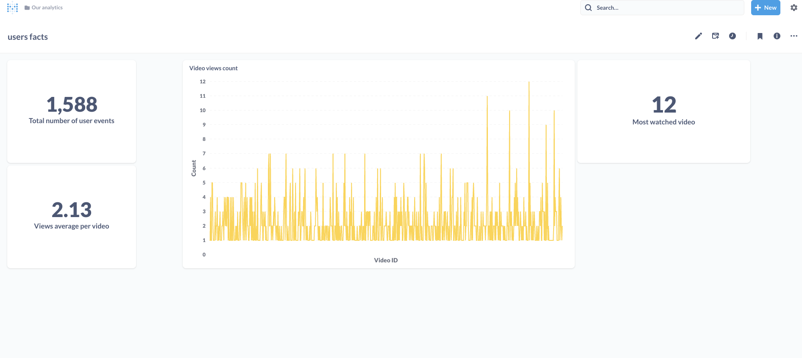

## Interview project

#### Start Users service
- On `users` directory:
- 
    ` > set -a; source .env; set +a `

    ` > npm start `

- Add new user/users: 
  
    ` http://localhost:3000/add-users `

#### Simulation orchestrator
- On `simulation-orchestrator` directory:
- 
    ` > set -a; source .env; set +a`

    ` > npm start `

- Generate-users: 
    ```
    http://localhost:4000/generate-users

        request body:
        {
            "wave_height": 20,
            "wave_width": 1
        }
    ```

    `- wave_height = Maximum number of users per wave`

    `- wave_width = Number of seconds (ex: 3 = 3seconds , 60 = 60seconds  )`

#### Streaming Server
- install minikube
- minikube start --static-ip 192.168.49.2
- minikube addons enable metrics-server
- on streaming-server directory: `kubectl apply -f .`

#### Kafka
- Run `docker-compose up`
- Create `server-events` topic:
    ```
        docker exec -it my-kafka /opt/bitnami/kafka/bin/kafka-topics.sh \ 
        --create \
        --bootstrap-server 192.168.49.1:9092 \
        --replication-factor 1 \
        --partitions 1 \
        --topic server-events
    ```
- Create `user-events` topic:
    ```
        docker exec -it my-kafka /opt/bitnami/kafka/bin/kafka-topics.sh \ 
        --create \
        --bootstrap-server 192.168.49.1:9092 \
        --replication-factor 1 \
        --partitions 1 \
        --topic user-events
    ```

#### Analytics
- Download plugin from `https://www.confluent.io/hub/mongodb/kafka-connect-mongodb`
- Replace this path `/tmp/custom/jars` by the path to this plugin in `docker-compose.yml` 
- Run `docker-compose up` 
- Create `mongodb sink connector` for the topics:
  
    > User sink connector
    ``` 
        curl --location --request PUT 'http://localhost:8083/connectors/mongodb-sink-user-events/config' \
        --header 'Content-Type: application/json' \
        --data-raw '{"connection.uri":"mongodb://mongo-db:27017/analytics",
        "database":"analytics",
        "collection": "userevents",
        "topics": "user-events",
        "connector.class": "com.mongodb.kafka.connect.MongoSinkConnector",
        "tasks.max": "1",
        "key.converter": "org.apache.kafka.connect.json.JsonConverter",
        "value.converter": "org.apache.kafka.connect.json.JsonConverter",
        "key.converter.schemas.enable": "false",
        "value.converter.schemas.enable": "false"
        }'
    ```    
    ---
    > Server sink connector
    ``` 
        curl --location --request PUT 'http://localhost:8083/connectors/mongodb-sink-server-events/config' \
        --header 'Content-Type: application/json' \
        --data-raw '{"connection.uri":"mongodb://mongo-db:27017/analytics",
        "database":"analytics",
        "collection": "serverevents",
        "topics": "server-events",
        "connector.class": "com.mongodb.kafka.connect.MongoSinkConnector",
        "tasks.max": "1",
        "key.converter": "org.apache.kafka.connect.json.JsonConverter",
        "value.converter": "org.apache.kafka.connect.json.JsonConverter",
        "key.converter.schemas.enable": "false",
        "value.converter.schemas.enable": "false"
        }'
    ```

- Open `http://localhost:3001/` to view the bi dashboard

